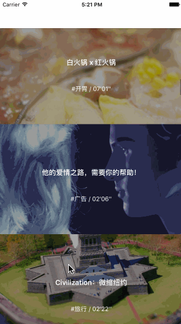
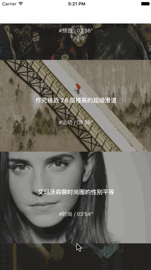
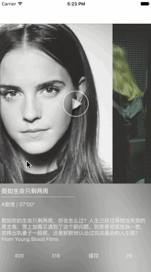
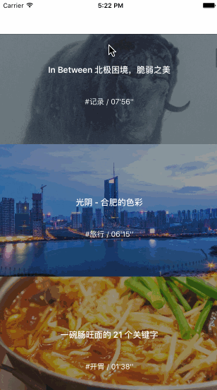

# 开眼

仿开眼app列表效果 ，
增加了 寺库的 视差效果

##效果图

## 联系我

juvham@foxmail.com

## License

Released under the MIT license. See [LICENSE(`MIT`)](https://github.com/juvham/OneMoreThing/blob/master/LICENSE "MIT License") for detail
